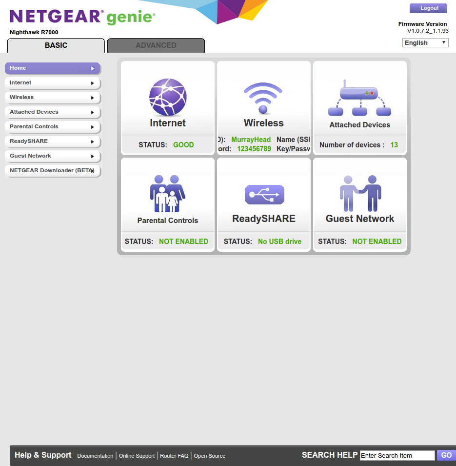
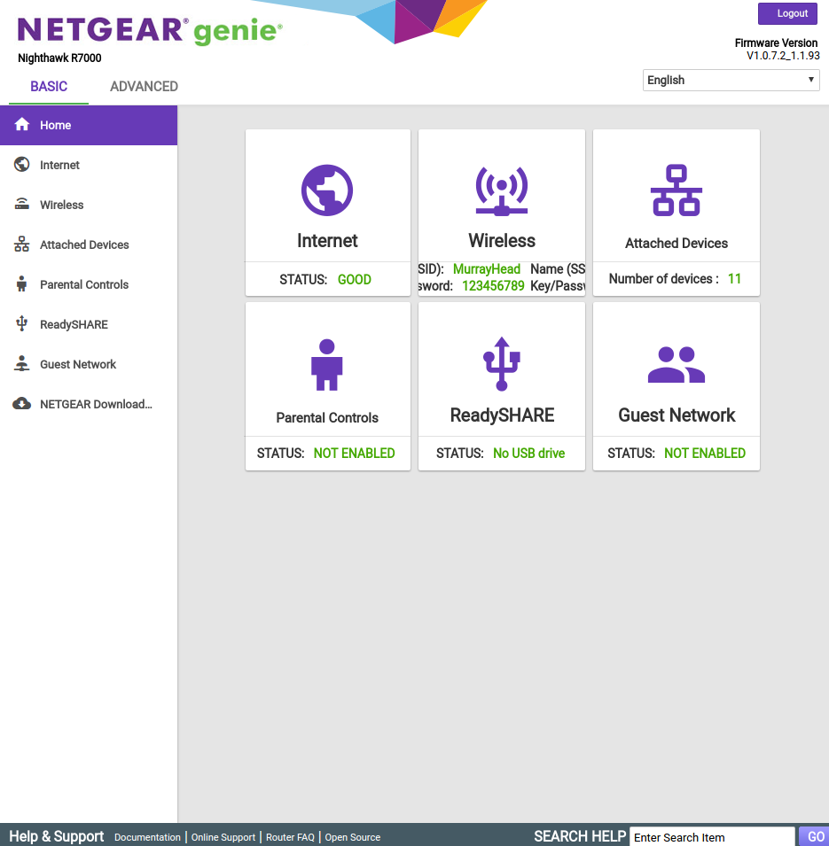

#  Material Netgear Genie

This project's aim is to enhance Netgear Genie's interface by injecting custom stylesheets
into its web interface via a Google Chrome or Firefox extension.

This redesign is hugely inspired by [Google's Material design guidelines](https://material.google.com/).

| Before | After |
|--------|-------|
|  |  | 

## How does it work?
Quite straight-forward actually: [`injector.js`](data/js/injector.js) file is injected by
either Chrome or Firefox inside the tab. Its aim is to inject the necessary resources -
`style.css`, `content-script.js`, MaterialDesignIcons stylesheet and Roboto font.

We use SCSS (compiled CSS) to override Netgear Genie's styles alongside with some Javascript when necessary.

That's it!

This project relies on the following resources:

* [Material Design Icons](https://materialdesignicons.com)
* [Roboto font](https://www.google.com/fonts/specimen/Roboto)

### How about security?
That's a legitimate question: you can browse Javascript files ([`injector.js`](data/js/injector.js)
and [`content-script.js`](data/js/content-script.js)) in this repo or directly from Chrome's
debugger tools - to see that their sole purpose is to manipulate the DOM to apply some styling
that couldn't be set in CSS.

## How to contribute
Do not hesitate to open issues or to create pull requests against the master branch!
The main project is based on SCSS to build CSS files: you'll need an appropriate compiler
alongside with some Chrome extensions notions.

> Note: we're using the EditorConfig standard to supply coding rules for this project,
learn more about it [here](http://editorconfig.org/).

> Warning: this is not meant to be perfect. Netgear Genie's UI is quite difficult to
style, and some changes aren't possible for now. I'd rather keep this project maintainable
and compatible with upcoming releases of Netgear Genie than doing some Javascript black
magic.

## Licensing
Material-Netgear-Genie is distributed under the GNU GPL version 2.
"Netgear Genie" is a registered trademark of Netgear. All rights reserved.
